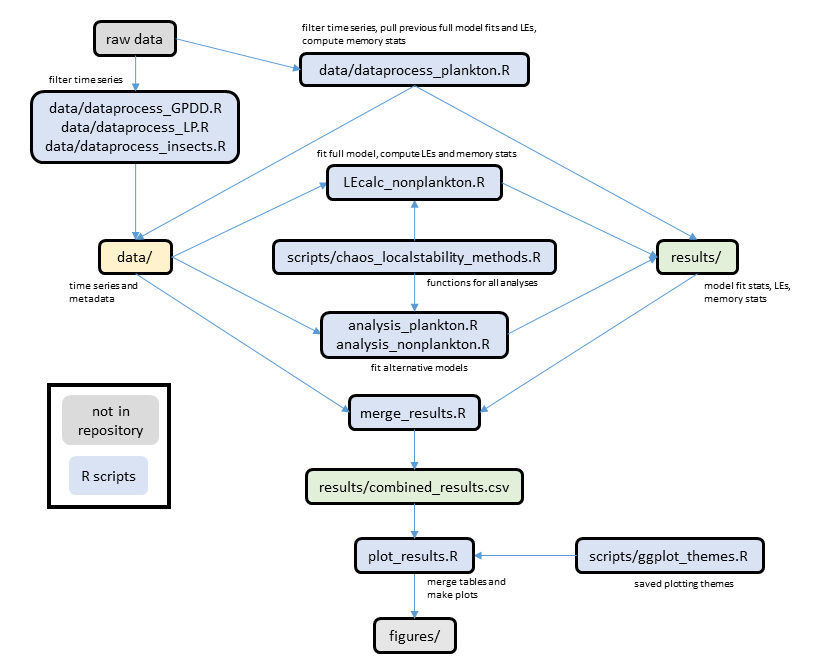

# Memory, chaos, and noise in ecological forecasting

<!-- badges: start -->
<!-- badges: end -->

This repository is associated with the paper "Memory, chaos, and noise in
ecological forecasting" by Stephan Munch and Tanya Rogers.

The Living Planet Index data and some of the plankton data are not
redistributable, so these time series are omited from this repository. Thus, the
results for these series cannot be reproduced. However, we have provided the
metadata and results for all series analyzed, and the figures can be reproduced
from the `combined_results.csv` file using the `plot_results.R` script.

For data citations, see Supplementary Note 2 and the metadata files.

Reuse of the **source data** in this repository should cite both the original source(s) 
and this study, and comply with the original license terms for each dataset. 
